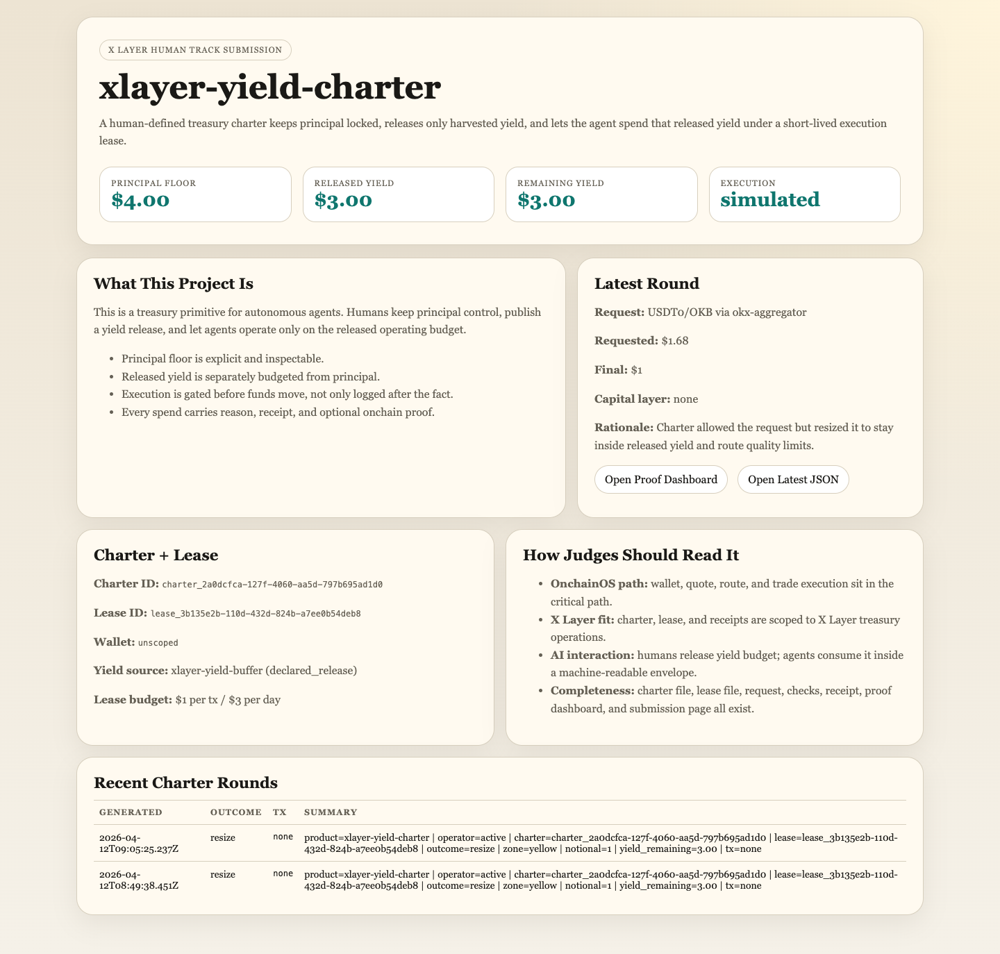
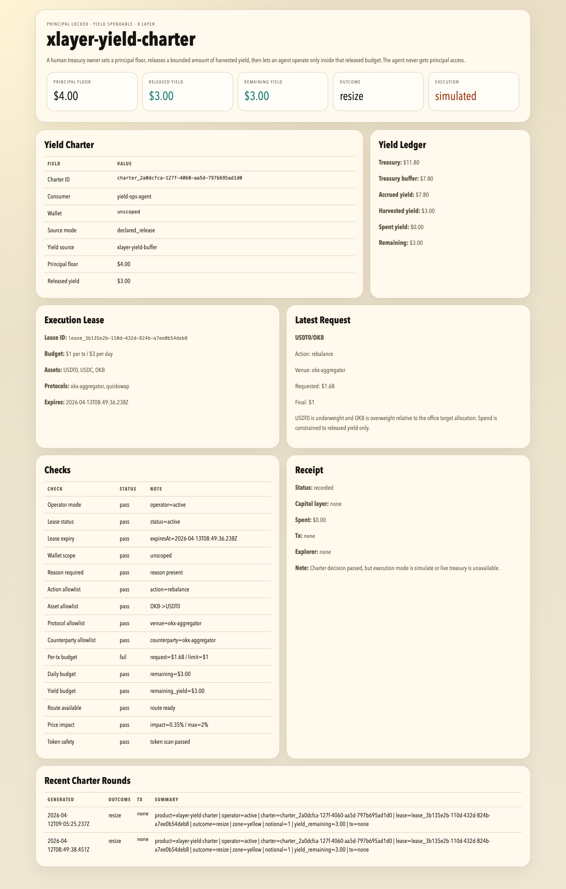

# X Layer Yield Charter


Principal-locked operating budget for autonomous agents on X Layer.

> Let agents spend yield, not principal.

## Judge Summary

| What judges should look for | Evidence |
| --- | --- |
| Human governance primitive | A human-defined charter sets principal floor, released yield, wallet scope, protocol scope, and operator mode. |
| DeFi-native X Layer fit | The project models agent operating budgets as harvested yield, not generic wallet allowance. |
| OnchainOS / Agentic Wallet path | Runtime uses wallet balance reads, route quotes, token safety checks, and optional live swap execution through the shared Agentic Wallet flow. |
| AI interaction experience | Agents receive a machine-readable budget boundary and get resized / blocked before execution. |
| Product completeness | CLI scripts, policy engine, proof JSON, proof dashboard, submission page, systemd templates, and OpenClaw runbook are included. |

## One-Line Pitch

X Layer Yield Charter lets a human treasury owner keep principal locked while autonomous agents spend only harvested and released yield.

## Why This Matters

Autonomous agents can trade, rebalance, pay for services, and call APIs. The dangerous part is not autonomy itself. The dangerous part is giving an agent unconstrained wallet access.

Yield Charter changes the default boundary:

```text
principal stays owned by the human
harvested yield becomes the agent operating budget
agent requests pass through policy checks before funds move
receipts prove what happened
```

That makes it closer to a DeFi treasury primitive than a normal bot dashboard.

## Latest Proof Snapshot

Current committed sample proof comes from `npm run round:live` in sample mode.



| Field | Value |
| --- | --- |
| Product | `xlayer-yield-charter` |
| Network | X Layer mainnet profile, chain ID `196` |
| Principal floor | `$4.00` |
| Released yield | `$3.00` |
| Remaining yield budget | `$3.00` |
| Latest request | `OKB -> USDT0` rebalance |
| Requested notional | `$1.68` |
| Final notional | `$1.00` |
| Decision | `resize` |
| Capital layer | `none` in sample mode, `yield` when live execution broadcasts |
| Latest proof JSON | [`examples/live-proof-latest.json`](examples/live-proof-latest.json) |
| Proof dashboard | [`examples/proof-dashboard.sample.html`](examples/proof-dashboard.sample.html) |
| Submission page | [`examples/submission.sample.html`](examples/submission.sample.html) |



## Product Flow

```text
human treasury owner
  -> sets principal floor
  -> releases harvested yield budget
  -> issues execution lease
  -> agent proposes spend / rebalance
  -> charter checks yield budget
  -> lease checks wallet, asset, protocol, counterparty, budget, route, token risk
  -> request is approved, resized, blocked, or sent to review
  -> receipt + proof packet are written
```

## Implemented Modules

| Module | Path | Purpose |
| --- | --- | --- |
| Runtime agent | [`src/runtime/yield-charter-agent.ts`](src/runtime/yield-charter-agent.ts) | Runs a charter round, builds candidate spend, gates execution, writes proof. |
| Charter policy | [`src/charter/policy.ts`](src/charter/policy.ts) | Issues the principal floor and released-yield charter. |
| Yield ledger | [`src/charter/ledger.ts`](src/charter/ledger.ts) | Computes accrued, harvested, spent, and remaining yield budget. |
| Lease gate | [`src/lease/policy.ts`](src/lease/policy.ts) | Enforces pre-execution controls including yield budget, per-tx, daily budget, route, and token safety. |
| OnchainOS client | [`src/onchainos/cli.ts`](src/onchainos/cli.ts) | Loads local env/proxy and calls OnchainOS wallet, quote, swap, and security commands. |
| Portfolio manager | [`src/portfolio/manager.ts`](src/portfolio/manager.ts) | Reads balances, detects allocation drift, quotes candidates, and executes swaps. |
| Proof surfaces | [`src/historian`](src/historian) | Generates JSON proof, dashboard HTML, and submission HTML. |

## OnchainOS Usage

The runtime is built to use these OnchainOS / Agentic Wallet capabilities:

| Capability | How it is used |
| --- | --- |
| Agentic Wallet balance | Reads X Layer wallet state before each round. |
| DEX quote / route | Verifies that a spend or rebalance route exists before approval. |
| Swap execution | Optional live mode broadcasts the resized yield-funded swap. |
| Token safety | Checks unknown target token risk before execution. |
| Proof / audit trail | Every decision is serialized into a proof packet and dashboard. |

## Quick Start

```bash
npm install
cp .env.example .env.local
npm run check
npm run demo:prepare
npm run status:latest
npm run demo:serve
```

Open the local demo server printed by `npm run demo:serve`.

## Live Mode

Set these in `.env.local`:

```bash
CHARTER_EXECUTION_MODE=live
XLAYER_TREASURY_ADDRESS=0xdbc8e35ea466f85d57c0cc1517a81199b8549f04
XLAYER_SETTLEMENT_TOKEN_ADDRESS=0x74b7f16337b8972027f6196a17a631ac6de26d22
CHARTER_PRINCIPAL_FLOOR_USD=4
CHARTER_RELEASED_YIELD_USD=3
```

Then run:

```bash
npm run preflight:treasury
npm run charter:issue
npm run lease:issue
npm run round:live
npm run status:latest
```

For local machines that need a proxy, set `ONCHAINOS_PROXY=http://127.0.0.1:7890`. On OpenClaw/server deployment, leave proxy variables empty unless the server actually needs them.

## Why It Is Different

Most agent finance projects optimize for more autonomy. Yield Charter optimizes for safer autonomy:

- agents can operate without waiting for every manual click
- principal remains outside the agent spending budget
- every spend has reason, policy result, receipt, and proof
- the budget is generated from yield, not raw treasury principal

## Repository Layout

```text
src/
  charter/       principal floor, yield release, yield ledger
  lease/         pre-execution policy gate
  runtime/       round runner and operator state
  onchainos/     Agentic Wallet / OnchainOS CLI client
  portfolio/     wallet, quote, route, and execution helpers
  historian/     proof dashboard and submission page renderer
scripts/         CLI entrypoints
docs/            architecture, runbooks, scoring, submission answers
examples/        committed proof JSON and HTML samples
deploy/systemd/  OpenClaw/server timer templates
```

## Submission Docs

- [`docs/ARCHITECTURE.md`](docs/ARCHITECTURE.md)
- [`docs/SCORING_ALIGNMENT.md`](docs/SCORING_ALIGNMENT.md)
- [`docs/DEMO_VIDEO_SCRIPT.md`](docs/DEMO_VIDEO_SCRIPT.md)
- [`docs/OPENCLAW_RUNBOOK.md`](docs/OPENCLAW_RUNBOOK.md)
- [`docs/SUBMISSION_FORM_ANSWERS.md`](docs/SUBMISSION_FORM_ANSWERS.md)
- [`docs/SUBMISSION_CHECKLIST.md`](docs/SUBMISSION_CHECKLIST.md)
- [`docs/X_POST_DRAFTS.md`](docs/X_POST_DRAFTS.md)
- [`docs/REFERENCE_REPOS.md`](docs/REFERENCE_REPOS.md)

## Current Scope

V1 is application-layer enforcement plus proof. It proves the operating model now:

- principal floor is explicit
- released yield is separately tracked
- agent spend is capped to released yield
- execution is pre-gated
- proof and receipts are generated

V2 should add a contract-native vault and direct yield-source adapters, but the current project is already runnable and judge-inspectable.
