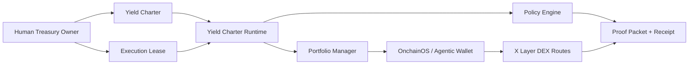
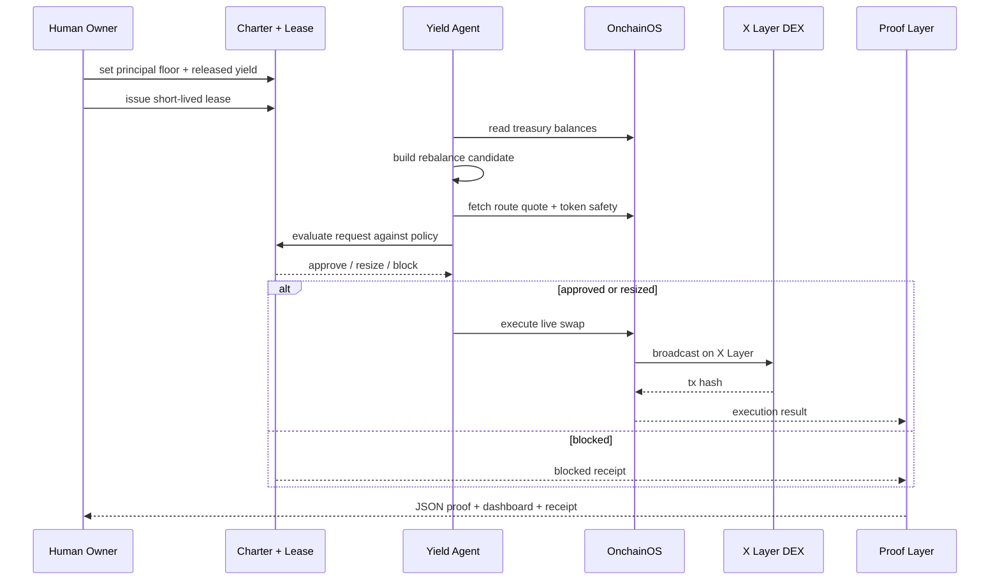

<p align="center">
  
</p>

# X Layer Yield Charter

<p align="center">
  <a href="https://yield-charter.vercel.app"></a>
  <a href="https://yield-charter.vercel.app/proof"></a>
  <a href="https://www.oklink.com/xlayer/tx/0x15cca235de24f037bfab1f5489aa23940e442dd6c1ea22ebadd878a52aa321d0"></a>
  
  
  
  
</p>

> The product that lets you give an AI agent a spending budget without giving it your treasury.

## 30-Second Pitch

If you want an agent to trade or rebalance with real money, today you usually get two bad options:

1. give the agent broad wallet access, or
2. manually approve every action.

`X Layer Yield Charter` creates a third mode.

A treasury owner locks the principal, releases a smaller operating budget, and sets the rules for what the agent is allowed to do. The agent can trade or rebalance only inside that budget. If a request is too large, unsafe, or outside scope, the system resizes or blocks it before execution.

In product terms, this is an **agent budget guard** for X Layer.

## What The Product Does

With Yield Charter, a treasury owner can:

- keep the main treasury protected
- release only a small budget to the agent
- define allowed assets, protocols, and daily limits
- let the agent keep operating without manual clicks
- inspect every request, decision, and tx receipt afterward

So the operating model becomes:

```text
treasury owner sets rules
agent asks to spend
system checks rules
system approves / resizes / blocks
receipt and tx proof are written
```

## Who This Is For

- teams running trading agents
- teams running treasury rebalancers
- teams giving agents real operating budgets on X Layer
- builders who want autonomy without full wallet exposure

## For Hackathon Judges

| Item | Link / Evidence |
| --- | --- |
| Live app | [yield-charter.vercel.app](https://yield-charter.vercel.app) |
| Live proof dashboard | [yield-charter.vercel.app/proof](https://yield-charter.vercel.app/proof) |
| Latest proof JSON | [yield-charter.vercel.app/live-proof-latest.json](https://yield-charter.vercel.app/live-proof-latest.json) |
| GitHub repo | [richard7463/xlayer-yield-charter](https://github.com/richard7463/xlayer-yield-charter) |
| Track | Build X Human Track / X Layer Arena |
| Treasury wallet | `0xdbc8e35ea466f85d57c0cc1517a81199b8549f04` |
| Latest live tx | [`0x15cca235de24f037bfab1f5489aa23940e442dd6c1ea22ebadd878a52aa321d0`](https://www.oklink.com/xlayer/tx/0x15cca235de24f037bfab1f5489aa23940e442dd6c1ea22ebadd878a52aa321d0) |
| Capital layer proof | `receipt.capitalLayer = "yield"` in latest proof packet |
| Demo and submission docs | [`docs/DEMO_VIDEO_SCRIPT.md`](docs/DEMO_VIDEO_SCRIPT.md), [`docs/SUBMISSION_FORM_ANSWERS.md`](docs/SUBMISSION_FORM_ANSWERS.md) |

## Scorecard

This section maps the Build X judging dimensions to concrete repo and live evidence.


| Build X dimension | Why this project fits | Repo / live evidence |
| --- | --- | --- |
| OnchainOS integration and innovation | Uses Agentic Wallet balance reads, live route quotes, token safety checks, and live swap execution in the control path. | [`src/onchainos/cli.ts`](src/onchainos/cli.ts), [`src/portfolio/manager.ts`](src/portfolio/manager.ts) |
| X Layer ecosystem integration | Runs on chain `196`, uses X Layer treasury state, and broadcasts a real yield-funded trade on X Layer mainnet. | [latest tx proof](https://www.oklink.com/xlayer/tx/0x15cca235de24f037bfab1f5489aa23940e442dd6c1ea22ebadd878a52aa321d0) |
| AI interactive experience | Human defines machine-readable treasury boundaries; the agent receives a budget envelope and gets resized or blocked before execution. | [`src/runtime/yield-charter-agent.ts`](src/runtime/yield-charter-agent.ts) |
| Product completeness | Includes runtime, policy engine, live proof packet, proof dashboard, submission page, server timer templates, and deployment runbooks. | [`deploy/systemd/`](deploy/systemd/), [`docs/OPENCLAW_RUNBOOK.md`](docs/OPENCLAW_RUNBOOK.md) |

## Live Proof Snapshot

This snapshot is from the latest locally broadcasted live round on **2026-04-13 14:10:08 UTC**.

| Metric | Value |
| --- | --- |
| Treasury value | `$16.83` |
| Principal floor | `$4.00` |
| Released yield | `$3.00` |
| Yield spent | `$1.00` |
| Remaining yield budget | `$2.00` |
| Latest request | `USDT0/OKB` rebalance |
| Requested notional | `$3.23` |
| Final notional | `$1.00` |
| Decision | `resize` |
| Execution status | `broadcasted` |
| Capital layer | `yield` |
| Route | `QuickSwap V3 -> CurveNG` |
| Latest tx | [`0x15cca235de24f037bfab1f5489aa23940e442dd6c1ea22ebadd878a52aa321d0`](https://www.oklink.com/xlayer/tx/0x15cca235de24f037bfab1f5489aa23940e442dd6c1ea22ebadd878a52aa321d0) |
| Latest JSON proof | [yield-charter.vercel.app/live-proof-latest.json](https://yield-charter.vercel.app/live-proof-latest.json) |

## Screenshots

### Submission Surface


### Proof Dashboard


## Why This Is Different

| Old way | Yield Charter |
| --- | --- |
| Give the agent raw wallet balance | Split capital into principal floor and released yield |
| Approve or reject after the trade | Gate budget, route, token, protocol, and counterparty before execution |
| Generic wallet allowance | Capital-layer-aware treasury boundary |
| Hard to prove what budget the agent actually used | Receipt explicitly records `capitalLayer`, `spentUsd`, `txHash`, and proof packet |
| A risky bot setup | A usable treasury product for agent operators |

## Product Surface

### 1. Human Treasury Charter

The human owner defines:

- principal floor
- released yield budget
- treasury operator mode
- spend asset and yield source semantics

### 2. Execution Lease

The lease defines the agent's operating envelope:

- per-tx budget
- daily budget
- allowed assets
- allowed protocols
- allowed counterparties
- expiry window
- proof requirement

### 3. Pre-Execution Policy Engine

Before any execution path is used, the runtime checks:

- operator mode
- lease status and expiry
- wallet scope
- reason presence
- asset / action / protocol / counterparty allowlists
- per-tx and daily budgets
- released yield remaining
- route availability
- price impact
- token safety

### 4. Proof And Receipt Layer

Every round writes:

- `live-proof-latest.json`
- Next.js submission route at `/`
- Next.js proof route at `/proof`
- rolling `rounds/*.json`
- receipt records with tx and capital layer evidence

## Architecture



## Runtime Sequence



## Repository Map

| Path | Responsibility |
| --- | --- |
| [`app/`](app) | Public Next.js app router surface for `/`, `/submission`, `/proof`, and `/api/live-proof` |
| [`components/`](components) | Product-facing submission and proof UI |
| [`lib/`](lib) | Shared formatting, file-backed site data, and view types |
| [`src/runtime/yield-charter-agent.ts`](src/runtime/yield-charter-agent.ts) | Orchestrates the full charter round |
| [`src/charter/`](src/charter) | Principal floor, released yield, yield ledger |
| [`src/lease/`](src/lease) | Pre-execution lease policy and receipt storage |
| [`src/portfolio/`](src/portfolio) | Balance reads, allocation drift, quote, execution |
| [`src/onchainos/`](src/onchainos) | OnchainOS / Agentic Wallet CLI integration |
| [`src/historian/`](src/historian) | Legacy HTML proof export generation used for snapshots and offline artifacts |
| [`scripts/`](scripts) | Local / live commands |
| [`deploy/systemd/`](deploy/systemd) | Server timer templates |
| [`docs/`](docs) | Architecture, runbooks, demo script, submission copy |
| [`examples/`](examples) | Committed proof JSON and HTML snapshots |

## OnchainOS / Agentic Wallet Integration

| Capability | How it is used |
| --- | --- |
| Agentic Wallet balance | Reads the X Layer treasury wallet before every round. |
| DEX quote | Verifies route availability and price impact before execution. |
| Swap execution | Broadcasts the resized yield-funded swap in live mode. |
| Token safety | Rejects unsafe or degraded target tokens. |
| Proof path | Binds execution result to receipt and proof packet. |

## Local Run

```bash
npm install
cp .env.example .env.local
npm run check
npm run demo:prepare
npm run status:latest
npm run demo:serve
```

Then open:

- `http://127.0.0.1:4312/`
- `http://127.0.0.1:4312/proof`

## Live Mode

This repo now has a proven local live path. The latest live round broadcasted a yield-funded trade through OnchainOS on X Layer mainnet.

Required env shape:

```bash
CHARTER_EXECUTION_MODE=live
XLAYER_TREASURY_ADDRESS=0xdbc8e35ea466f85d57c0cc1517a81199b8549f04
CHARTER_PRINCIPAL_FLOOR_USD=4
CHARTER_RELEASED_YIELD_USD=2
CHARTER_PER_TX_USD=0.5
CHARTER_DAILY_BUDGET_USD=2
ONCHAINOS_PROXY=http://127.0.0.1:7890   # local Mac only if needed
```

Then run:

```bash
npm run preflight:treasury
npm run charter:issue
npm run lease:issue
npm run operator:resume -- "live start"
npm run round:live
npm run status:latest
```

## Vercel Deployment

The public product surface is now a standalone Next.js app deployed from the repo root.

- Live app: [yield-charter.vercel.app](https://yield-charter.vercel.app)
- Proof dashboard: [yield-charter.vercel.app/proof](https://yield-charter.vercel.app/proof)
- Latest JSON: [yield-charter.vercel.app/live-proof-latest.json](https://yield-charter.vercel.app/live-proof-latest.json)

To redeploy:

```bash
cd /path/to/xlayer-yield-charter
vercel deploy --prod --scope ritsuyans-projects
```

## Submission Package

- [`docs/ARCHITECTURE.md`](docs/ARCHITECTURE.md)
- [`docs/SCORING_ALIGNMENT.md`](docs/SCORING_ALIGNMENT.md)
- [`docs/DEMO_VIDEO_SCRIPT.md`](docs/DEMO_VIDEO_SCRIPT.md)
- [`docs/OPENCLAW_RUNBOOK.md`](docs/OPENCLAW_RUNBOOK.md)
- [`docs/SUBMISSION_FORM_ANSWERS.md`](docs/SUBMISSION_FORM_ANSWERS.md)
- [`docs/X_POST_DRAFTS.md`](docs/X_POST_DRAFTS.md)
- [`docs/REFERENCE_REPOS.md`](docs/REFERENCE_REPOS.md)

## Team

Solo build in this repo.
